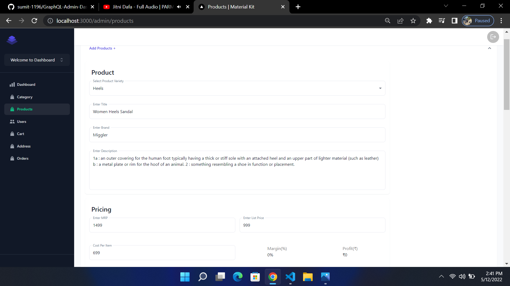

# GraphQL-Admin-Dashboard
GraphQL Admin Dashboard Using Python Django and Next.js

1. Simply add .env file where settings.py file exist in django backend in same directory.
2. Enter MongoDB Atlas Credentials in .env file :- Username , Password and Database 
3. OR
4. You can simply uncomment MongoDB localhost Connections in settings.py 

