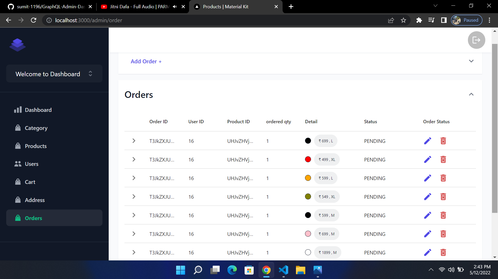
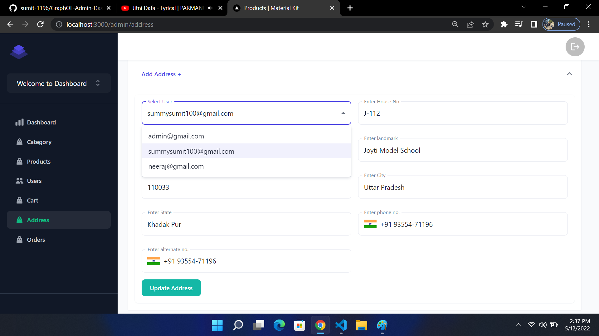
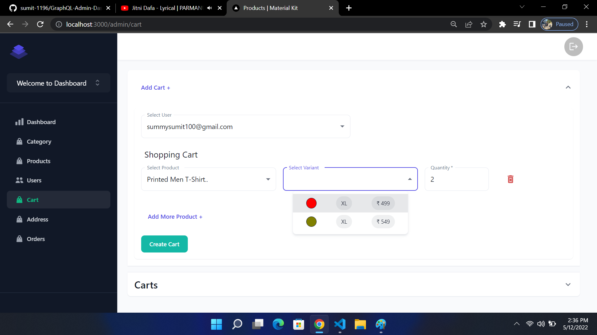

# GraphQL Admin Dashboard for eCommerce Product Management

Welcome to the GraphQL Admin Dashboard repository! This dashboard provides an efficient solution for managing eCommerce products, users, carts, addresses, and orders. It allows performing CRUD operations on these entities through GraphQL queries and mutations. The frontend is built using Next.js, Material UI, HTML, and CSS, while the backend is powered by Python, Django, and the database used is MongoDB.

## Table of Contents

- [Features](#features)
- [Technologies Used](#technologies-used)
- [Setup](#setup)
- [Usage](#usage)
- [Preview](#preview)
- [Contributing](#contributing)
- [License](#license)

## Features

- Product Management: Perform CRUD operations on eCommerce products.
- User Management: Manage user accounts and perform necessary operations.
- Cart Management: View and manage user shopping carts.
- Address Management: Add, update, and delete user addresses.
- Order Management: Track and manage user orders.
- GraphQL API: Utilize GraphQL queries and mutations for efficient data retrieval and modification.

## Technologies Used

- Frontend: Next.js, Material UI, HTML, CSS
- Backend: Python, Django
- Database: MongoDB

## Setup

- Frontend
  
1. Clone the repository to your local machine.
    ```bash
    git clone https://github.com/sumit-singh1196/GraphQL-Admin-Dashboard.git

2. Navigate to the frontend-project directory.
    ```bash
    cd frontend-GraphQL

3. Install the required dependencies.
    ```bash
    npm install

4. Start the frontend-local server.
    ```bash
    npm run dev

- Backend
 
1. Navigate to the backend-project directory.
    ```bash
    cd backend-GraphQL

3. Install the required dependencies.
    ```bash
    pip install -r requirements.txt

4. Configure the backend connection and MongoDB settings in the .env file.

5. Start the backend-local server.
    ```bash
    python manage.py runserver
    
## Usage
1. Login to the admin dashboard using your credentials.
2. Use the provided GraphQL queries and mutations to perform CRUD operations on products, users, carts, addresses, and orders.
3. Retrieve and manipulate data efficiently using GraphQL APIs.
4. Use either mongoDB-Atlas or mongoDB locally.

## Preview
- Here's a preview image of the GraphQL Admin Dashboard for eCommerce Product Management:
- 






## Contributing
- Contributions to the GraphQL Admin Dashboard project are welcome! If you find any issues or want to suggest improvements, please open an issue or submit a pull request.

## License
- This project is licensed under the MIT License.
- Make sure to place the preview image in a folder named "previews" at the root of your project directory, and update the image path accordingly in the README.md file.
